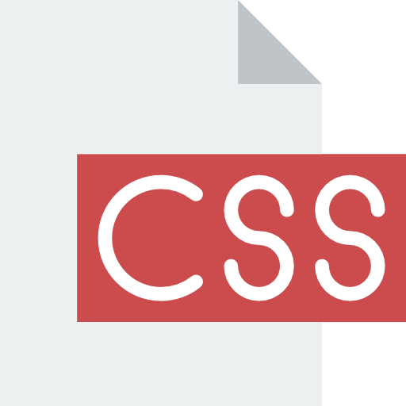

#    

### Introducción
Ejercicio práctico para poner en práctica la lógica de programación, aprendido en los cursos de **Principiante en Programación** del programa **Oracle Next Education (ONE)** y **Alura Latam**.

### :memo: Título: **Amigo Secreto** 

**Amigo Secreto** es una aplicación web sencilla que permite organizar un sorteo de amigos secretos.  
Simplemente ingresa los nombres de los participantes, y la aplicación se encargará de asignar aleatoriamente los pares.

## Características ✨

- **Agregar participantes**: Ingresa los nombres de tus amigos o familiares.
- **Validación de nombres**: Asegúrate de que los nombres sean válidos y no estén duplicados.
- **Sorteo aleatorio**: Realiza el sorteo de manera justa y aleatoria.
- **Interfaz amigable**: Diseño simple y fácil de usar.

## Cómo usar 🚀

1. Accede a la aplicación a través del siguiente enlace: [Amigo Secreto App](https://rrojask.github.io/amigo-secreto/)
2. Ingresa los nombres de tus amigos o familiares.
3. Haz clic en el botón "Sortear" para asignar los amigos secretos.

## :hammer_and_wrench: Herramientas y Tecnologías Utilizadas

- **Editor de código**: [Visual Studio Code](https://code.visualstudio.com/)
- **Plataforma de código**: [GitHub](https://github.com/)
- **Lenguajes**:
  - 
  - 
  - 

## Estado del Proyecto ⚠️
**En construcción**. Estamos trabajando para corregir errores y mejorar la experiencia de usuario.

## :memo: Licencia

Distribuido bajo la licencia [MIT](https://opensource.org/licenses/MIT).

